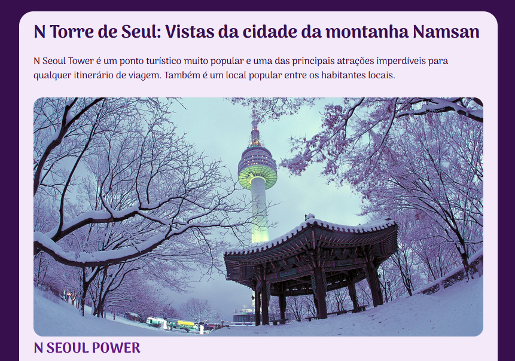

<h1 align="center"> Coréia a sua espera </h1>

Uma pagina com informações sobre um dos principais pontos turisticos da Coréia do Sul.  

  <a href="#-tecnologias">Tecnologias</a>&nbsp;&nbsp;&nbsp;|&nbsp;&nbsp;&nbsp;
  <a href="#-projeto">Projeto</a>&nbsp;&nbsp;&nbsp;|&nbsp;&nbsp;&nbsp;
  <a href="#-layout">Layout</a>&nbsp;&nbsp;&nbsp;|&nbsp;&nbsp;&nbsp;

 

  

## 🚀 Tecnologias

Esse projeto foi desenvolvido com as seguintes tecnologias:

- HTML e CSS
- Git e Github

## 💻 Projeto

Uma pagina de informações sobre um ponto local turistico.

- [Visite o projeto online](https://maysaleal.github.io/nlw-setup)
